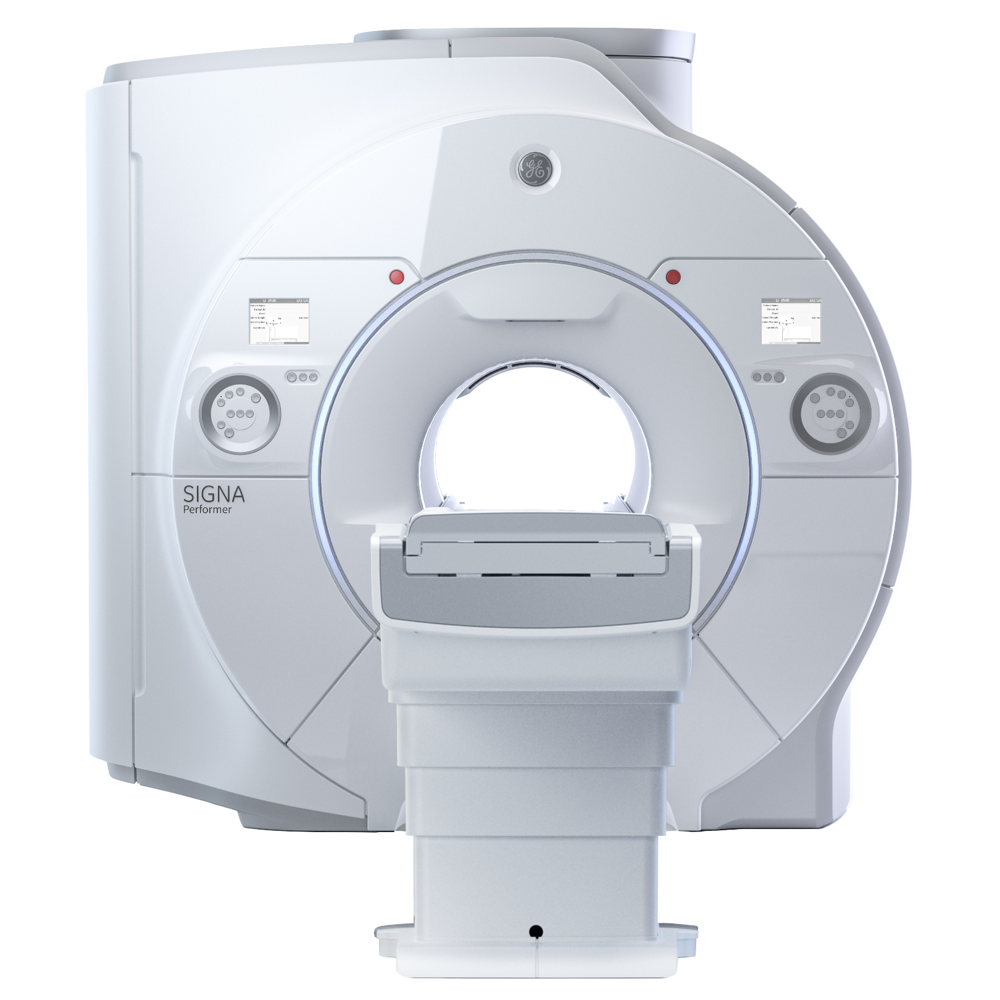
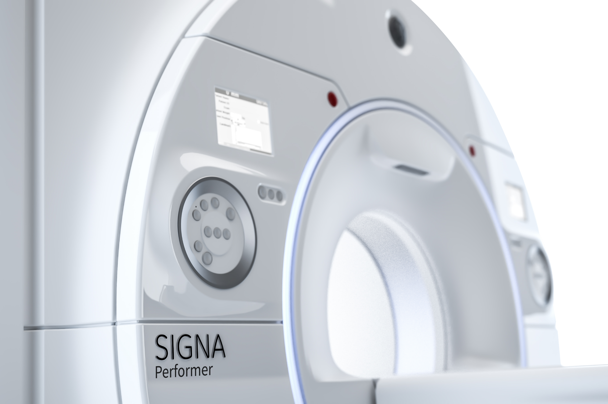
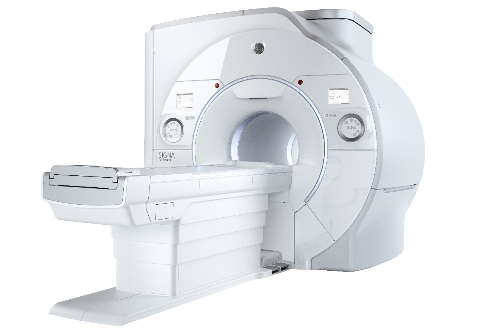
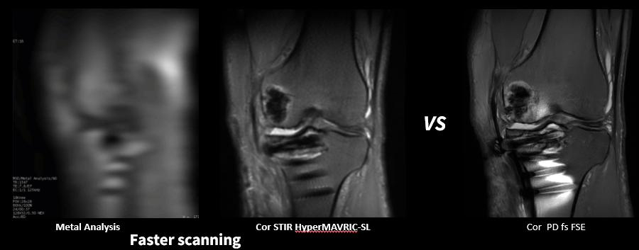

GE医疗

## Forge

SIGNA™ Performer

让不可能的事情变成可能

想象一下MR未来会如何

## 突破限制

明显进步，且具有显著的优势

在SIGNA™ Performer 3.0T磁共振设备的辅助下，核磁共振技术取得了明显进步，SIGNA™ Performer 3.0T磁共振设备是一种先进的成像设备，结合了最新的核磁共振技术以及GE医疗的直观设计特征。在新SIGNA™ Works应用平台的推动下，协调了SIGNA™ Performer的形态和功能设计。其所有内容均经过精心设计，旨在显著提高工作效率、增强安全性、改进诊断方法等。

欢迎来到核磁共振技术的未来。与SIGNA™ Performer携手前进。

先进的成像功能：  SIGNATM Performer 3.0T成像的 卓越实力

SIGNA Performer融汇软硬件尖端创新科技，以卓越成像品质赋能全景临床应用，以超凡标准铸就当今市场全能型3.0T成像系统之典范。

<u>配备电容触摸屏的室内12.1"双显示屏</u>

<u>从头到脚全覆盖，搭配完备的全身成像工作流程与足部先入扫描技术</u>

<u>深度嵌入系统核心架构的深度学习工具</u>

<u>3.0T和70 cm</u>

<u>宽孔径扫描仪</u>

<u>45 mT/m、200 T/m/s梯度性能</u>

<u>采用新一代低氦平台磁体</u>

洞悉SIGNATM Performer的非凡价值

**放射科团队**

医护工作的幕后功臣

在检查需求与日俱增的当下，放射科团队

正承受着前所未有的重压。

**先进成像功能**

高质量3.0T影像，清晰度无与伦比，全方位满足各类临床应用需求

**高值创新**

专为提升患者接诊量精心打造的高性能3.0T系统，高效运转，助力医疗提速

**增强临床精度**

借助深度嵌入系统核心架构的深度学习工具，为临床诊断提供坚实可靠的保障

## SIGNA™ Works

新标准且具有非凡的意义

新SIGNA™ Works平台通过相关方案重新定义所有核心成像技术的功能。SIGNA™ Works标准应用序列组合是一套广泛的优质高效的成像程序，能够在整个实践领域达到理想的结果。

SIGNA™ Works是命脉、是灵魂——是推动影像技术达到更高水平的驱动因素。SIGNA™ Works标准应用序列是一套完全集成的解决方案。这是一项增值技术，可升级并进一步用户化，以便灵活添加应用程序，满足不断增长的业务需求。

SIGNA™ Works 充分利用 TDI（全数字成像），进一步推进诊断和加快流通量，同时改善患者治疗效果和投资回报率。

Cube DIR

1.4×1.4×1.4mm

T2 PROPELLER MB冠状面（倒置）

.6×.6×3mm

## **NeuroWorks**

这种一站式解决方案可通过明显的组织对比度有效地对大脑、脊柱、血管和周围神经解剖结构进行成像。这些对运动不敏感技术的特点是单击自动对准，即可提供从扫描到后期处理期间的完整的神经网络解决方案。

NeuroWorks还包括Cube，这是我们的3D容积成像序列，是每个系统的标准配置。这种应用程序可以抑制脑脊液和白质或灰质，凸显病变位置。

PROPELLER MB是最新的PROPELLER技术，可采用多激发方式，无论权重如何，都能确保组织对比度符合要求，同时还能减少运动伪影。此外，这项新技术引入了新的对比度，如T1 FSE。

## **OrthoWorks**

这种广泛的肌肉骨骼成像技术序列库可通过明显的组织对比度对骨骼、关节和软组织进行成像。

OrthoWorks还可以测定3D体积和质子密度，结合中红外光谱仪，能够提高脂肪抑制成像方面的均匀性，通常通过三次单独的2D扫描完成。通过单次3D采集和多平面重建法，Cube可代替单独的2D扫描。

PD FatSat Cube矢状面

.6×.6×1.2mm

PD FatSat冠状面

2×3×2.5mm

## **BodyWorks**

通过BodyWorks，我们可以应对核磁共振技术发展最快的一个领域。这个包罗万象的技术库可对腹部和骨盆解剖构造进行成像，可灵活地用于不同类型的患者。

GE采用PB Navigator应对腹部成像中的呼吸运动问题。这种应用于自由呼吸状态下的方法与多种脉冲序列兼容，包括扩散、PROPELLER MB、MRCP和动态T1成像。

3D MRCP

1.4×1.4×1.2mm

FSPGR轴向动态

1×1×1.5mm

T2 PROPELLER 冠状面

.8×.8×3mm

导航的Turbo LAVA

自由呼吸状态下的动态肝脏

1.9×2×4mm

：20s/期

## **OncoWorks**

这种广泛的技术库可捕获解剖学和形态学数据，对解剖构造进行独特的肿瘤评估。OncoWorks包含明显的组织对比度、运动不敏感、高时间和空间分辨率成像功能、

3D容积成像技术具有优化的绝热脂肪抑制功能，结合ARC或ASET，可提供高空间和时间分辨率的的对比度成像。

## **CVWorks**

借助直观的心脏成像技术，可评估形态学、血流、功能和组织活力，并深入了解血管结构和流体动力学。CVWorks可灵活地用于不同类型的患者，极大地简化了工作流程。

通过CVWorks可替代多次屏气成像技术。最新的Single Shot MDE和黑血技术为患者提供了舒适的屏气替代方案。

通过工作流程简化的QuickStep协议，扫描全身血管系统所需时间不到6min。高性能梯度有利于在Cine FIESTA上清晰对比的血池和心肌组织，同时确保空间分辨率符合要求。

2D Cine FIESTA

黑血技术——单次激发快速自旋回波序列

导航的Turbo LAVA

自由呼吸状态下的动态肝脏

1.2×1.7×2.6mm

：25 sec/阶段

QuickStep MRA

PS MDE

## **PaedWorks**

PaedWorks提供专门的协议，仅能满足极少数脆弱患者的需求。结合PROPELLER MB的PB Navigator等技术与扩散成像等先进技术一起使用，有利于对患者进行友好的、完全自由呼吸的检查。此外，使用Single Shot MDE进行心脏检查，可更快地提供更可靠的结果。

左图显示了使用PB Navigator的动态T1成像结果，采用这种技术，患者可以自由呼吸，同时可快速捕捉对比度。

可简单地通过常规T2 frFSE成像技术获得整个脊柱的评估结果（右）。

T2 frFSE矢状面

## **HyperWorks**

HyperCube

HyperCube扩展了3D成像的能力，以为您显著减少扫描次数，并通过在不出现伪影的情况下减少视野相区，以消除运动和扭曲等伪影。

HyperCube with Flex

HyperCube Axial

Knee Cube

.4×.4×.4mm

HyperMAVRIC SL

智能金属植入物分析成像技术，通过自动计算患者体内含金属部位，扫描所需的适当频率范围， 完成后，所需的中心频率数量将自动复制到每个 MAVRIC SL 的相关系列中，以减少扫描时间。

HyperSense

HyperSense是一种基于稀疏数据采样和迭代重建的加速技术。该应用能够提供更高空间分辨率的影像或减少扫描次数，实现更快的成像，且没有传统并行成像中常见的不利影响。HyperSense还可以与其他加速方法（ARC）相结合，以缩短时间实现高信噪比。

T2 Cube Two Station

Spine Axial and Coronal

MPR’s

3D MRCP

1.2×1.2×1.2mm

3D TOF

.4×.4×.4mm

为核磁共振技术的未来加油

## **关于GE HealthCare Technologies Inc.**

GE HealthCare是全球领先的医疗技术、药物诊断和数字化解决方案创新者，致力于提供整合解决方案、服务和数据分析，使医院运营更加高效、临床医生诊断更加有效、治疗方法更加精准、患者更加健康和幸福。历经125载春秋，GE HealthCare初心如磐，始终为患者与医疗服务提供者倾力服务。我们积极推动个性化、互联化与充满人文关怀的医疗护理模式发展，全力简化患者诊疗全程.我们的成像、超声、患者护理解决方案和药物诊断业务组合协同发力，全面覆盖诊断、治疗与监护环节，全方位升级患者护理品质。我们的业务规模高达196亿美元，全球约51,000名员工同心共创无界的医疗健康。

想要获取最新资讯，欢迎在LinkedIn、X（原Twitter）和Insights平台关注我们，或访问我们的网站gehealthcare.com以获取更多信息。

GE HealthCare保留随时变更本文所示规格和特性或停产上述产品的权利。如有变更，恕不另行通知。

© 2025 GE HealthCare版权所有。SIGNA、AIR和AIR Touch均为GE HealthCare的商标。

GE是General Electric Company的商标，根据商标许可予以使用。