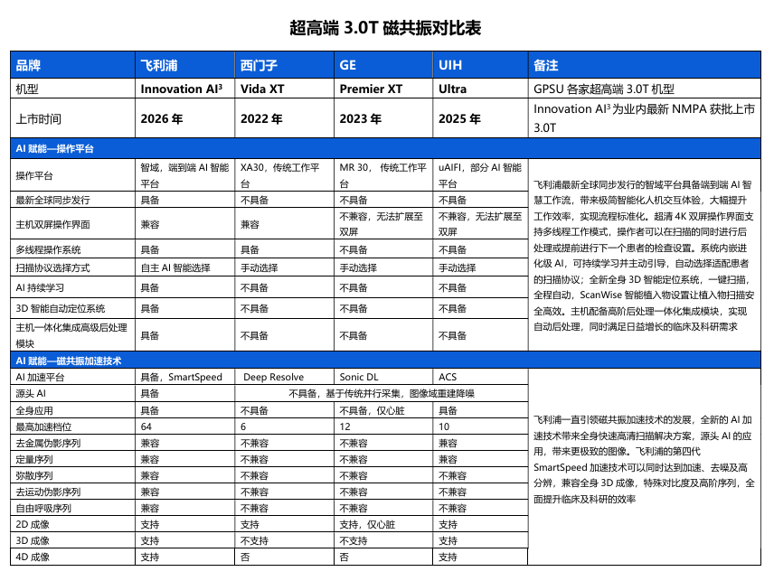
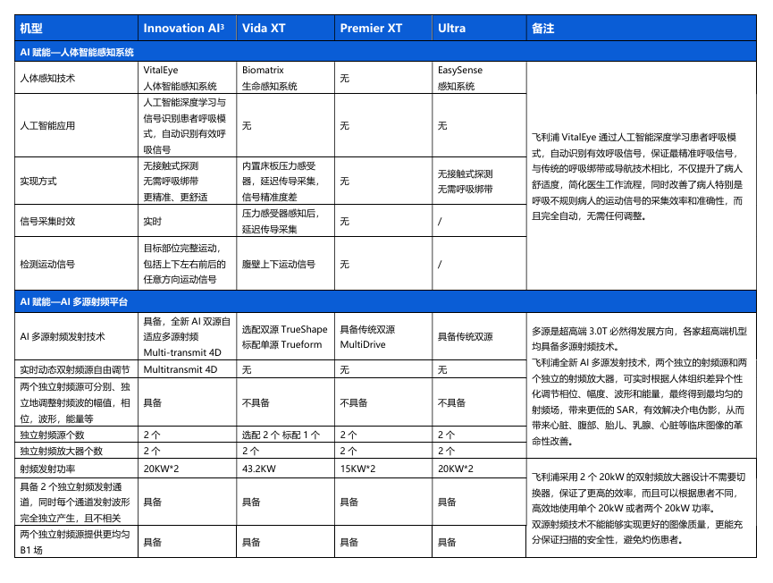
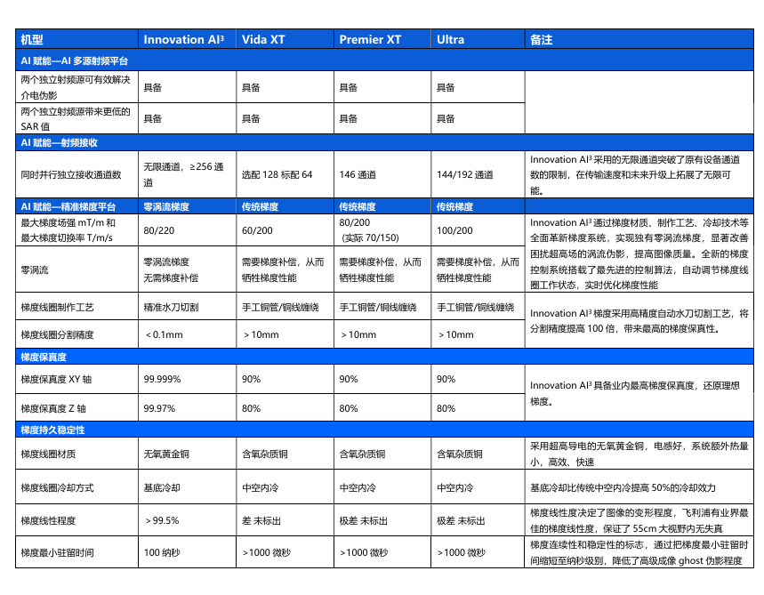
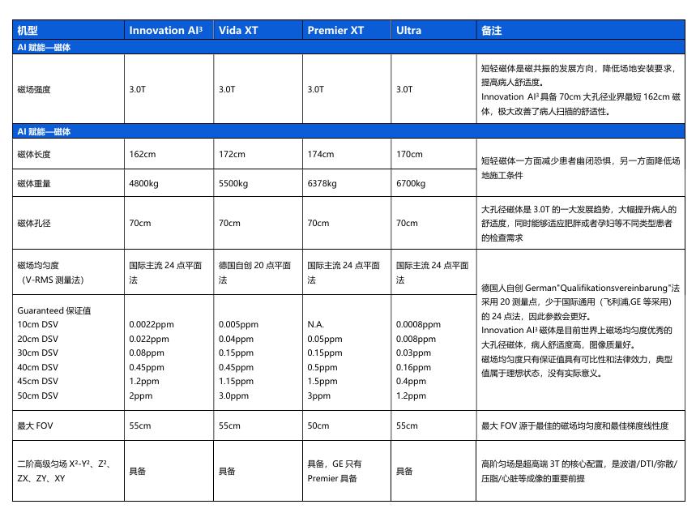
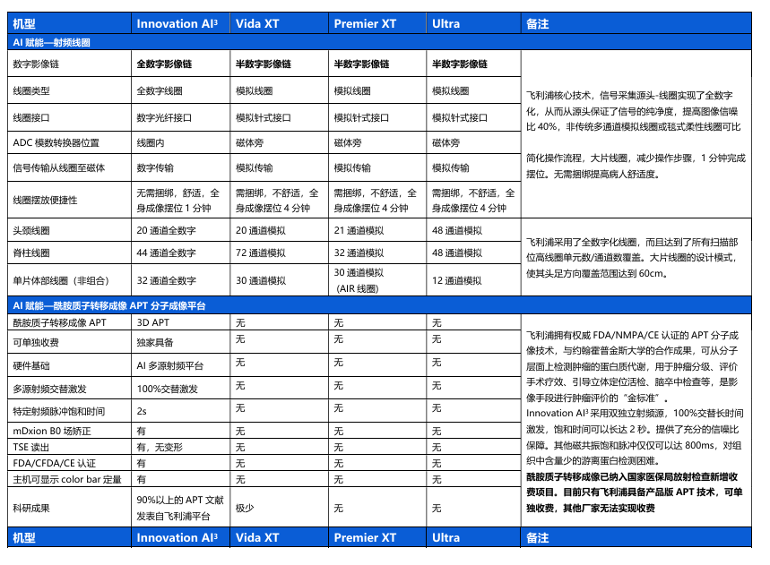
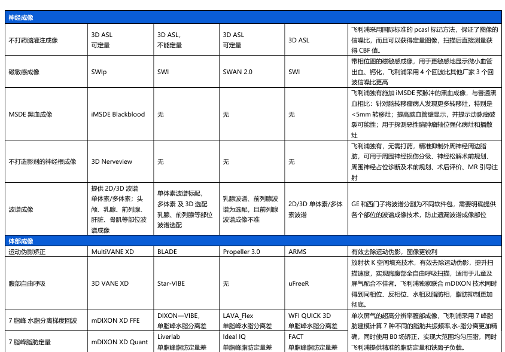
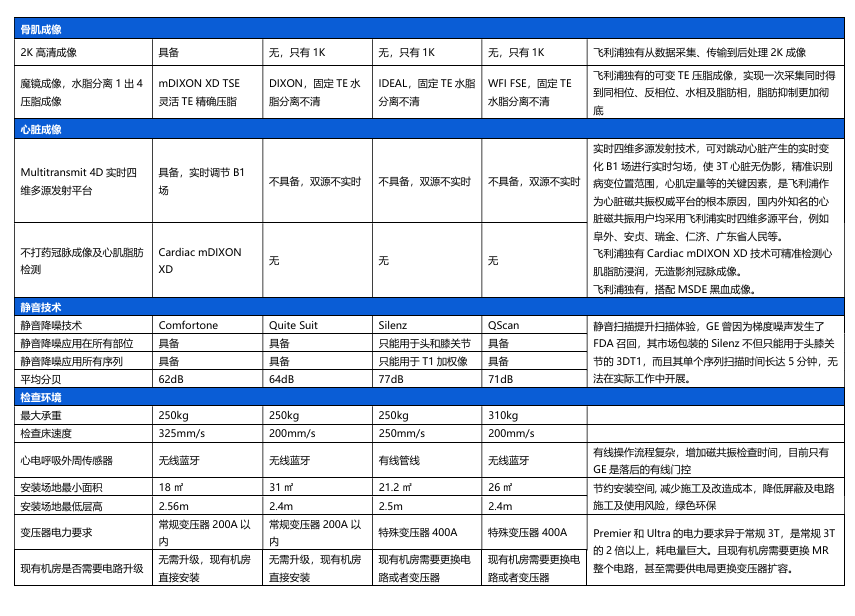
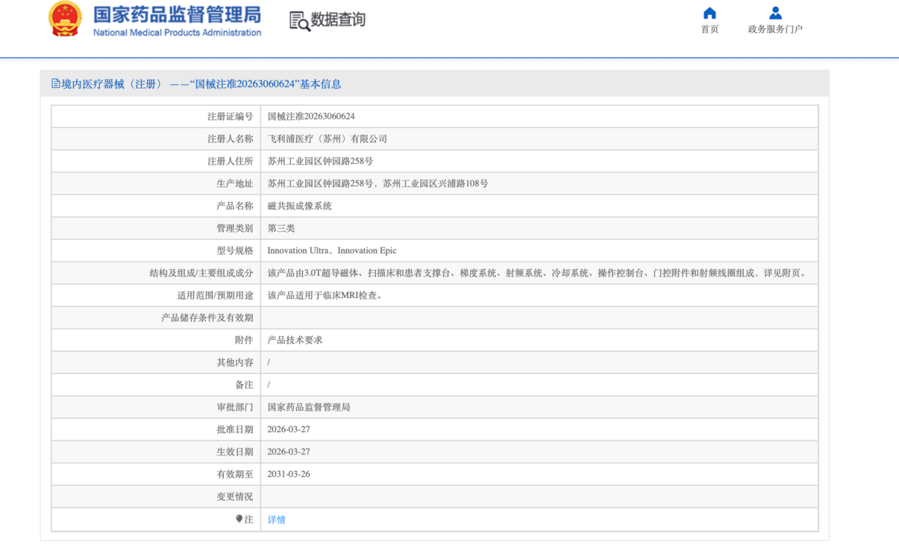
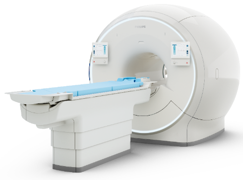

Philips Innovation AI3超脑平台磁共振

<table><tr><td>
设备名称
</td><td>
数量
</td><td>
设备报价

/台(套)
</td><td>
询价后价格

/台(套)
</td><td>
设备生产厂商全称
</td><td>
是否获授权
</td><td>
报价厂商全称
</td><td>
报价有效期
</td></tr><tr><td>
Innovation Ultra

（Innovation AI3）
</td><td>
1
</td><td>
1700万元/套
</td><td>
1700万元/套
</td><td>
飞利浦医疗（苏州）有限公司
</td><td>
是
</td><td>
飞利浦（中国）投资有限公司
</td><td>
六个月
</td></tr></table>

- Innovation AI3技术参数：

<table><tr><td>
<strong>序号</strong>
</td><td>
<strong>参数名称</strong>
</td><td>
<strong>参数值</strong>
</td><td>
<strong>临床优势</strong>
</td></tr><tr><td>
1
</td><td>
孔径
</td><td>
70cm
</td><td>
大孔径设计显著提升患者舒适度，减少幽闭恐惧感；便于肥胖患者、脊柱侧弯患者及需携带监护设备的重症患者检查；为介入操作和放疗定位提供充足空间，拓展临床应用范围
</td></tr><tr><td>
2
</td><td>
磁体长度（不含外壳）
</td><td>
162cm
</td><td>
短磁体设计大幅降低患者头端入磁体深度，显著减轻幽闭焦虑；提升头颈、脊柱等远端部位扫描的舒适性；便于儿童及老年患者配合，减少镇静需求；短磁体结构更利于科室空间布局与设备维护
</td></tr><tr><td>
3
</td><td>
相控阵射频同时并行接收独立通道数
</td><td>
全数字独立无限通道（&gt;256）
</td><td>
磁共振档次定位金标准，通道数越高越好。&gt;256通道实现超高并行采集加速，大幅缩短扫描时间；支持超高密度线圈，提升全身各部位信噪比与分辨率；目前科研型3.0T磁共振必须在128通道以上，是高端科研与精准临床诊断的核心硬件基础
</td></tr><tr><td>
4
</td><td>
梯度场强
</td><td>
80mT/m
</td><td rowspan="2">
<strong>零漂移梯度系统，</strong>在高梯度强度下树立了极致精准空间定位的最高标准。它实现了 80/220 的高梯度性能，不仅提供了卓越的空间分辨率，也大幅提升了快速成像能力。其中，单轴梯度保真度高达 99.999%，确保了对每个信号的精准定位，从而重建出最真实的影像。这不仅保证了图像的几何准确性，也为定量数据的可靠性奠定了坚实基础，对于需要高度精确测量的临床应用和科研项目具有里程碑式的意义。
</td></tr><tr><td>
5
</td><td>
梯度切换率
</td><td>
220T/m/s
</td></tr><tr><td>
6
</td><td>
射频源个数
</td><td>
2个
</td><td>
<strong>Hi-Fi 双射频系统</strong> 专注于信号的“纯净度与一致性”，通过行业领先的超低噪声设计，实现了低至 -165 dBm/Hz 的超低噪声水平，这一指标已接近物理噪声极限。在代谢成像（如 APT）等对信号敏感度要求极高的应用中，Hi-Fi 系统能够有效保留极其微弱的信号，使原本容易被淹没的关键信息得以真实呈现，从而显著提升对早期、微小病灶的检出能力，为临床医生提供更早期、更准确的诊断依据。

两个独立射频源可同时工作，实时个性化调节射频场，有效改善体部及心脏图像的B1均匀性；消除介电伪影，提升大视野成像质量；是超高场3T实现精准定量成像、多部位联合扫描的必备技术。
</td></tr><tr><td>
7
</td><td>
射频放大器个数
</td><td>
2个
</td><td>
双独立射频放大器分别驱动两个射频源，确保各通道功率稳定输出，避免信号串扰；是实现精准定量成像、快速扫描及复杂序列（如多激发EPI）的硬件基础
</td></tr><tr><td>
8
</td><td>
射频最大功率
</td><td>
2×20KW
</td><td>
40KW总射频功率储备充足，满足多通道同时激发、大视野覆盖及快速序列（如Turbo Spin Echo、EPI）的高能量需求；确保高B1场均匀性，改善深部组织（如腹部、盆腔）信号穿透；支持全身各部位高质量成像，保障高流通量检查的稳定输出
</td></tr><tr><td>
9
</td><td>
人体智能感知系统
</td><td>
Vital Eye
</td><td>
Vital Eye智能感知技术实时监测患者呼吸及体动，自动触发扫描；摆脱传统呼吸门控的绑带束缚与配合门槛，减少因患者呼吸不规律导致的重复扫描；显著提升检查效率，改善老年、儿童及重症患者的检查体验
</td></tr><tr><td>
10
</td><td>
下一代智能工作域平台
</td><td>
SmartSpace
</td><td>
双屏（27寸、4K高清屏）临床科研并行模式，实现扫描与后处理同步进行；全流程自动化智能极简操作，有效减少扫描准备时间；减轻技师工作负担，降低人为操作失误；提升临床流通量，优化科室运营效率
</td></tr><tr><td>
11
</td><td>
深度学习平台
</td><td>
具备
</td><td>
AI嵌入成像全流程，从患者定位、扫描参数优化、图像重建到后处理分析，每个环节都有AI的参与。

在保障图像真实度的同时，扫描速度提升3倍，微小病灶的检出能力大幅提升65%；赋能精准诊断与科研转化。
</td></tr></table>

- 临床效果：

飞利浦 Innovation 3.0T 超脑磁共振通过 Hi-Fi 双射频系统实现-165 dBm/Hz 超低噪声，精准捕获微弱信号，显著提升早期微小病灶检出能力；80/220零漂移梯度系统以 99.999% 保真度确保图像几何精准与定量可靠；双 AI 重建架构在提速三倍的同时杜绝"幻觉"风险，微小病灶检出能力提升 65%；智域平台实现扫描与后处理并行，简化心脏等复杂检查流程，大幅提升临床效率与患者体验。实现临床科研的极限突破：最高25000b值弥散、最高1024方向的DTI成像、最快18秒冠脉成像、最高2秒每期超高时间分辨率动态增强成像、代谢物定量研究平台等等突破。

- 经济学价值：

1.使用年限：10年

2.仪器设备的检测项目工作量及收费标准：

项目名称：磁共振扫描

每月工作量：2700人（90x30）

每个人次扫描所需平均时间：8分钟

收费标准：430元/人

3.年经济收入：约1400万元

4.年维修费用估计：120万元

- 参数对比表：

- 注册证

<table><tr><td>
<strong>飞利浦Innovation AI3 3.0T磁共振</strong>
</td><td></td></tr><tr><td>
主要特点：

<strong>1. Hi-Fi 双射频系统：微弱信号的精准捕获者</strong>

行业领先的超低噪声设计，实现-165 dBm/Hz 超低噪声水平，已接近物理噪声极限。该系统专注于信号的"纯净度与一致性"，在代谢成像（如 APT）等对信号敏感度要求极高的应用中，能够有效保留极其微弱的信号，使原本容易被淹没的关键信息得以真实呈现，从而显著提升对早期、微小病灶的检出能力，为临床医生提供更早期、更准确的诊断依据。

<strong>2. 零漂移梯度系统：空间编码的极致精准</strong>

采用 80/220 高梯度性能，单轴梯度保真度高达 99.999%，确保了对每个信号的精准定位，重建出最真实的影像。这不仅保证了图像的几何准确性，也为定量数据的可靠性奠定了坚实基础，对于需要高度精确测量的临床应用和科研项目具有里程碑式的意义。

<strong>3. 双 AI 全新重建架构：物理智能时代的革新</strong>

完美融合模型驱动与数据驱动的优势，实现物理保真度与泛化能力的平衡。该架构确保重建结果严格遵循采集到的原始 k 空间数据，有效杜绝了传统 AI 重建可能出现的"幻觉"或平滑掉微小病灶的风险。使用者只需选择"SmartSpeed"，系统即可自动匹配最优融合策略，实现"一键式"高质量成像，同时显著提高跨设备与跨操作员的一致性，大幅降低技师操作水平差异带来的图像质量波动。

<strong>4. 智域工作平台：全流程协同的智能引擎</strong>

飞利浦在中国首次与国际同步推出的超高端 3.0T 全域 AI 平台。AI 深度融入患者准备、协议选择、扫描执行和后处理的全流程，使磁共振系统从"依赖复杂操作的设备"升级为"能够主动协同的智能助手"。平台结合患者信息与历史操作习惯自动匹配扫描协议，配合双屏多线程架构与强大算力，支持扫描、后处理和下一位患者准备同步进行。EasyScanPlan 3D 智能定位大幅简化复杂部位（尤其是心脏）的检查流程，减少重复扫描；丰富的后处理与高阶应用集成进一步提升定量诊断能力和科研可及性。

<strong>5. 持续高质量数据资产：一次检查，持续增值</strong>

契合国家"数据要素×医疗健康"行动计划，医疗数据已从"行政资源"转变为医院"核心资产"。Innovation 3.0T 从软硬件层面全面升级，核心目标是为客户提供高质量、高保真的影像数据，构建"可计算、可科研、可交易"的高价值数字资产。上海数据交易所 2025 年已实现多例三甲医院数据产品挂牌交易，充分彰显高质量医疗数据的巨大价值。选择 Innovation 3.0T，意味着每一次检查都将转化为具有长远价值的数据资产，助力医院在数据驱动的医疗新时代中占据领先地位。

<strong>6. AI3 超脑平台：三脑协同的终极架构</strong>

"图形脑"保留高保真 k 空间原始数据与高频细节，确保图像信息完整真实；"数据脑"构建多维透视影像数据中台，为精准诊断提供多维度依据；"联合脑"通过黄金硬件将时空锁定，实现硬件与算法的深度协同，达成图像采集与重建的最优匹配。三脑协同使 AI 嵌入成像全流程，临床可及性高的规范性大范围高清成像将成为医院可增值的数字资产，为药物治疗评估提供重要证据。
</td><td>

<strong>产品名称：Innovation AI3</strong>

<strong>拿证时间：2026年3月</strong>
</td></tr><tr><td colspan="2">
较同类产品优势

飞利浦Innovation AI3与西门子大Vida XT、GE Premier XT、联影Ultra处于同一档次
<ol><li>这三款产品都是70厘米孔径，但飞利浦磁体更短、更轻，扫描体验感更舒适；</li><li>梯度切换率： 飞利浦切换率220T/m/s （其他家均为200 T/m/s），220T/m/s在速度和科研上优势更明显；</li><li>双源射频：Innovation AI3  、Premier 和Ultra双源发射技术是标配（多个独立射频放大器），Vida真正的双源技术TrueShape是选配（区别于单源技术Trueform），易超SAR，有灼伤风险和干扰工作进度；</li><li>智能工作流：Innovation AI3搭载下一代全程智驾智能极简工作流，双屏双GPU强大算力支持多任务态同步处理，其他厂家产品无；</li><li>智能深度学习AI提速降噪技术：Innovation AI3最大加速倍数64倍，加速降噪效果更好；其他厂商加速技术如Resolve、DL、ACS等有序列限制，部分仅支持2D序列。</li><li>其他高级功能：代谢研究平台、3D APT、18秒冠脉等都是其他厂家不具备的。</li></ol></td></tr></table>

- 近2年同规格型号设备中标通知书或合同、发票复印件等询价证明材料

由于是今年才获得注册证的产品，暂无销售记录

- 推荐配置：

-3D APT成像（代谢成像，独家NMPA获批）

-不打药冠脉MRA （独家技术）

-无创心肌定量成像（T1/T2/T2\*mapping）

-SmartSpeed深度学习加速技术

-SmartSpace智域工作平台

-Multitransmit4D多源射频发射技术