**上海交通大学医学院附属新华医院**

Xinhua Hospital Affiliated to SJTU School of Medicine

**2026年度上海市市级财政事前绩效评估项目**

## **市级医院专业设备购置及更新（乙类）**

### **新华医院大型医疗设备采购项目**

**评审汇报**

2026年3月30日

**汇报人：杜鹏**

**CONTENTS**

## **汇报提纲**

### **01**

**项目背景**

申报单位概况、学科优势、医教研成果、项目整体情况介绍

**医院综合实力展示**

### **02**

**立项依据**

TOMO与PET-MR配置理由、必要性论证、原有设备使用情况

**设备配置必要性分析**

### **03**

**实施内容**

人员配置、场地条件、配置许可证、实施进度计划

**项目实施保障**

### **04**

**预算与测算**

预算构成、效益测算、资金来源说明

### **05**

**绩效目标**

TOMO与PET-MR项目绩效指标、预期效益

**经济可行性分析**

**预期成效评估**

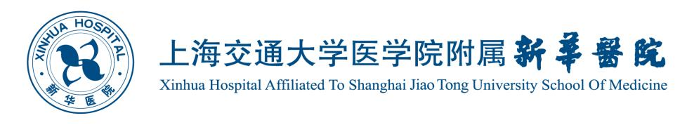

### **06**

**配置合理性**

设备核心技术参数、论证审批流程、供应商对比

**合规性与性价比**

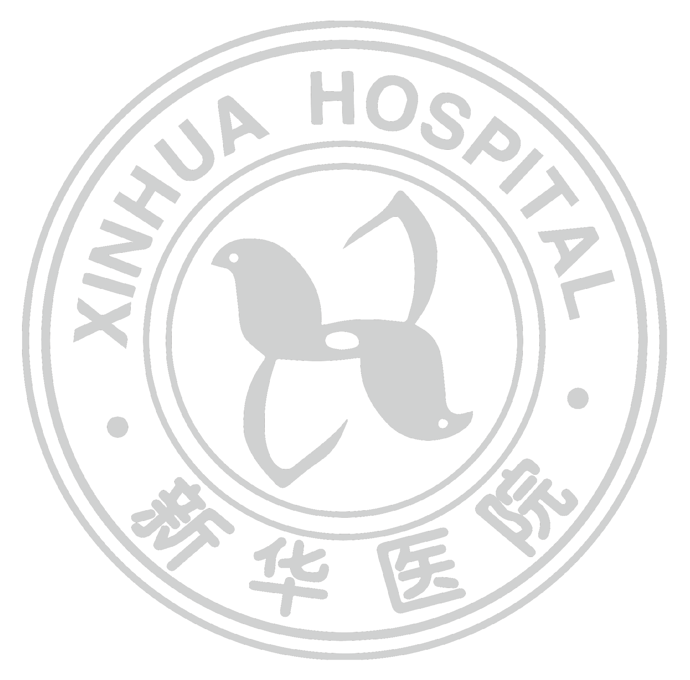

**CHAPTER 01**

## **项目背景**

申报单位概况、学科优势、项目整体情况介绍

**PROJECT BACKGROUND**

**申报单位概况**

**医院基本信息**

**创建时间：** 1958年，是新中国成立以来上海自行设计建设的首家综合性医院

**医院等级：** 三级甲等医院，学科门类齐全、特色鲜明

**特色定位：** 全市三级医院中唯一一所同时拥有围产和完整儿科亚专业的综合性医院，首批国家级儿童早期发展示范基地

**核心数据**

占地面积

**261**

亩（含奉贤院区约152亩）

核定床位

**2773**

张（含奉贤院区1200张）

**高镜朗**

**我国儿科医学界泰斗、一级教授**

**郭迪**

**我国儿童保健学创始人、终身教授**

**田雪萍**

**我国围产医学**

**奠基者**

**荣誉称号**

临床科室

**60**

全国先进集体

全国卫生系统先进单位

**何尚志**

**李丕光**

**梁其琛**

个（覆盖全生命周期服务）

上海市文明单位

上海市五一劳动奖状

**一代名医、曾任南京中央医院内科总主任**

**创造外科手术何氏切口缝合法**

**开展国内首例肺动脉狭窄心内直视手术**

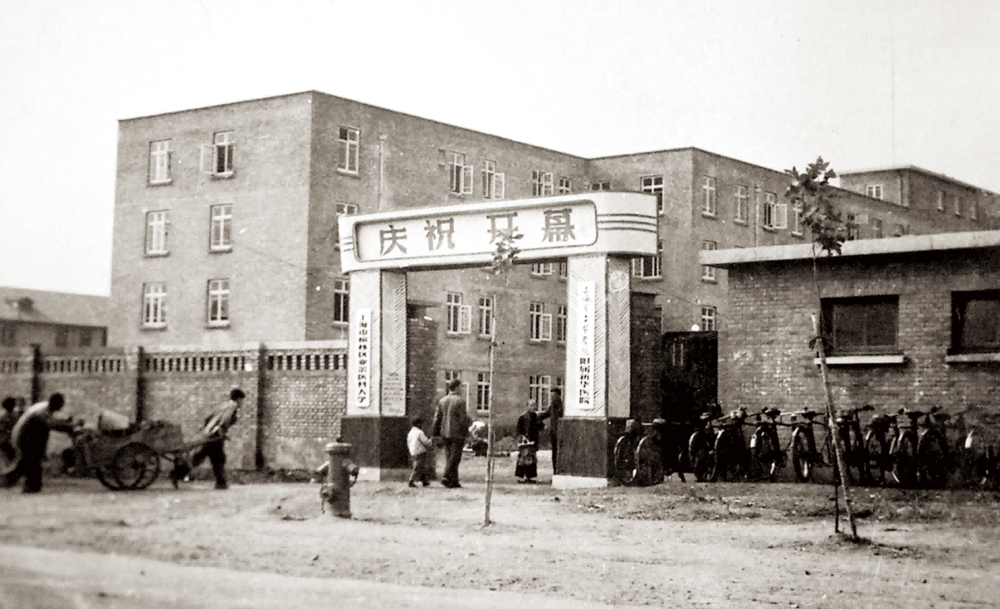

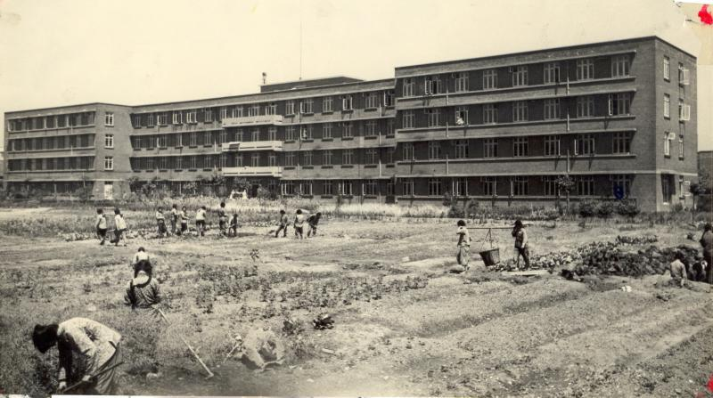

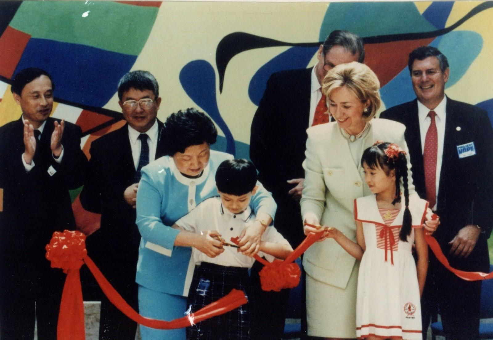

**服务定位**

覆盖全生命周期、全方位的患者服务，门急诊量位列上海医院前茅

**DISCIPLINARY ADVANTAGES**

## **学科优势与人才梯队**

**国家临床重点专科**

**11个**学科位列国家临床重点专科建设项目：

**心血管内科**

**普通外科**

**心脏大血管外科**

**小儿外科**

**急诊医学科**

**耳鼻咽喉头颈外科**

**皮肤科**

**儿内科小儿呼吸专业**

**中医儿科**

**检验科**

**临床药学**

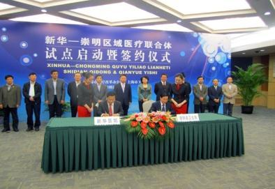

**人才队伍**

员工总数

医生

### **4711**

### **1303**

人

人

正高职称

### **247**

人

副高职称

### **415**

人

**高层次人才**

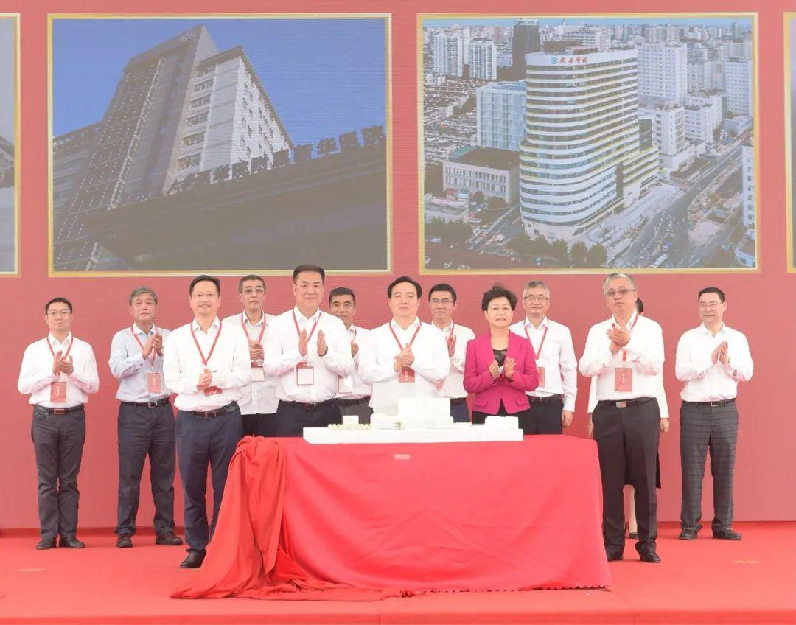

**省部级诊治中心**

**9个**省部级诊治及抢救中心，包括上海市小儿外科临床医学中心、上海市危重孕产妇会诊抢救中心、上海市危重新生儿会诊抢救中心、上海市产前诊断中心、上海市儿童听力障碍诊治中心、上海市新生儿先天性心脏病筛查诊治中心、上海市罕见病诊治中心、上海市儿童罕见病诊治中心等

**千**

**中组部"千人计划"**

2人

**杰**

**国家"杰青"**

3人

**长**

**教育部"长江学者"**

2人

**优**

**国家"优青"**

3人

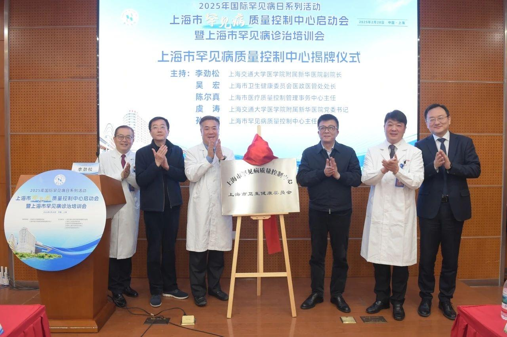

**RESEARCH & EDUCATION ACHIEVEMENTS**

## **医教研成果与荣誉**

**近5年省部级以上科研成果奖项**

共计 **31项** 省部级以上科研成果奖项，彰显医院科研实力

**国家科学技术进步奖**

**二等奖**

《小儿先天性心脏病介入诊疗体系创建及推广应用》

孙锟 - 宫内儿科学（2023）

**上海市科技进步奖**

**一等奖**

《常见小儿视网膜疾病防治体系的构建与推广》

赵培泉 - 眼科（2022）

**中华医学科技奖**

**一等奖**

《神经发育障碍的生命早期环境风险因素识别和防控体系建立与推广》

李斐 - 环境与儿童健康（2025）

**妇幼健康科学技术奖**

**一等奖**

《小儿肠衰竭临床诊治策略及基础研究》

王莹 - 儿消化与营养科（2023）

**学术影响力**

SCIE收录论文

### **490篇**

高质量学术论文持续产出

临床研究项目

### **100项**

创新成果转化应用

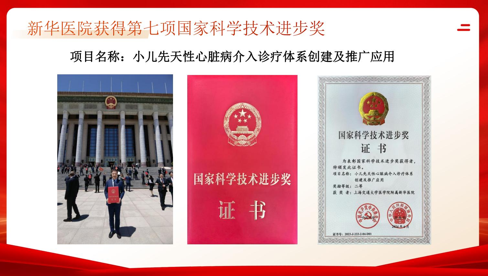

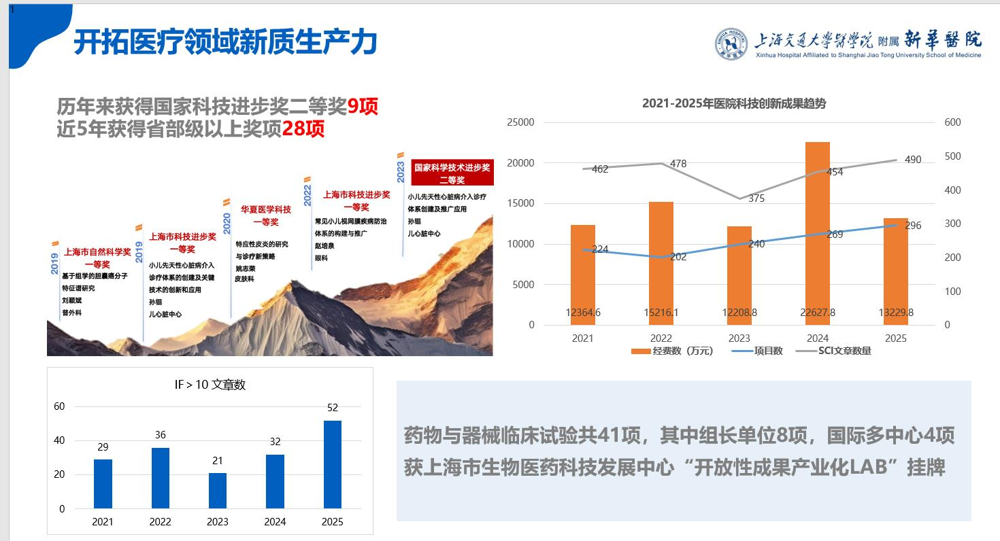

**Public Welfare Responsibility**

## **公益担当——服务国家与城市战略的践行者**

**01**

**全生命周期健康服务**

**04**

**新华医院**

**成人综合性医院**

**=**

**➕**

**儿童专科医院**

**近五年门急诊人次**

<table><thead><tr><th></th><th>门急诊人次</th></tr></thead><tbody><tr><td>2021</td><td>396.14</td></tr><tr><td>2022</td><td>369.97</td></tr><tr><td>2023</td><td>402.33</td></tr><tr><td>2024</td><td>415.59</td></tr><tr><td>2025</td><td>461.68</td></tr></tbody></table>

**63个临床、医技科室**

**确保0-100+健康服务**

**02**

**9 大省部级诊治抢救中心**

**凸显疑难危重症救治能力**

<table><thead><tr><th></th><th>出院人次</th><th>手术人次</th></tr></thead><tbody><tr><td>2021</td><td>12.77</td><td>5.85</td></tr><tr><td>2022</td><td>9.78</td><td>4.48</td></tr><tr><td>2023</td><td>14.14</td><td>6.35</td></tr><tr><td>2024</td><td>15.2</td><td>6.76</td></tr><tr><td>2025</td><td>16.46</td><td>6.65</td></tr></tbody></table>

**近五年出院人次和手术人次**

**03**

**11大国家临床重点专科**

**凝练专科专病特色**

**6个省部级研究基地**

**助力临床诊疗水平提升**

**Fengxian Campus**

## **奉贤院区——守护“健康上海”南大门**

**2025年6月28日，新华医院奉贤院区正式启用，为奉贤区首家综合性三甲医院**

**运行仅一周单日门诊量突破3000，新城配套民生工程项目落地见效的成功案例**

**疑难危重症救治实力突出**

CMI指数

急诊人次

抢救成功率

### **1.29**

### **7.87万**

### **98.6%**

**奉贤院区——** 上海"五大新城"重大民生配套工程，南上海区域首家综合性三甲医院顺利竣工启用

手术室14间，床位600张，成功开展首例急性心肌梗死急诊PCI、首例ECMO等关键技术，成功完成多项奉贤区首例高难度复杂手术。

**资源下沉力度空前**

所有科主任均在奉贤院区开诊，22名执行主任、14名负责人

700名常驻医务人员，医师中高级职称占比达到75%

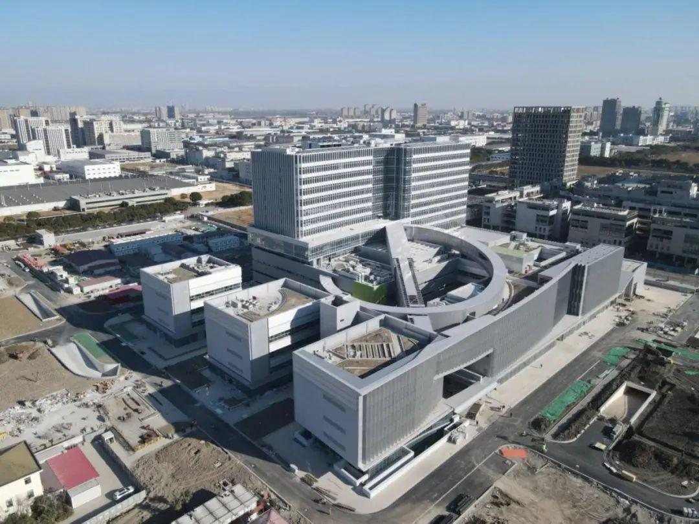

### **49.66万**

门急诊人次

### **1.41万**

出院人次

### **1.2万**

手术与操作人次

**Empower Health**

## **赋能健康——筑牢区域医疗保障防线**

<table><thead><tr><th></th><th>奉贤</th></tr></thead><tbody><tr><td>7月</td><td>65480</td></tr><tr><td>8月</td><td>75335</td></tr><tr><td>9月</td><td>86799</td></tr><tr><td>10月</td><td>80737</td></tr><tr><td>11月</td><td>86405</td></tr><tr><td>12月</td><td>96416</td></tr></tbody></table>

<table><thead><tr><th></th><th>2025年奉贤院区门急诊分布情况</th></tr></thead><tbody><tr><td>上海市</td><td>0.8645</td></tr><tr><td>外省市</td><td>0.1355</td></tr></tbody></table>

<table><thead><tr><th></th><th>2025年奉贤院区住院人群分布情况</th></tr></thead><tbody><tr><td>上海市</td><td>0.7725</td></tr><tr><td>外省市</td><td>0.2275</td></tr></tbody></table>

<table><thead><tr><th></th><th>住院人次</th></tr></thead><tbody><tr><td>7月</td><td>1427</td></tr><tr><td>8月</td><td>2131</td></tr><tr><td>9月</td><td>2584</td></tr><tr><td>10月</td><td>2578</td></tr><tr><td>11月</td><td>2595</td></tr><tr><td>12月</td><td>2794</td></tr></tbody></table>

<table><thead><tr><th></th><th>手术人次</th><th>四级手术例数</th><th>微创手术例数</th></tr></thead><tbody><tr><td>7月</td><td>746</td><td>221</td><td>247</td></tr><tr><td>8月</td><td>1163</td><td>410</td><td>438</td></tr><tr><td>9月</td><td>1235</td><td>476</td><td>505</td></tr><tr><td>10月</td><td>1206</td><td>433</td><td>452</td></tr><tr><td>11月</td><td>1299</td><td>486</td><td>495</td></tr><tr><td>12月</td><td>1283</td><td>496</td><td>475</td></tr></tbody></table>

**PROJECT OVERVIEW**

## **项目概况**

**项目基本信息**

项目名称

**2026年市级医院专业设备购置及更新（乙类）**

申报单位

**上海交通大学医学院附属新华医院**

项目负责人

**医院领导**

实施周期

**2026年1月 - 2026年12月**

**申报设备清单**

设备一

### **TOMO**

**螺旋断层放射治疗系统**

全球唯一360度连续螺旋照射技术，精准放疗设备

**预算： 3700万元**

设备二

### **PET-MR**

**正电子发射型磁共振成像系统**

PET功能与MR解剖结构一体化高端分子影像设备

**预算： 2600万元**

**项目背景与意义**

**健康中国战略：** 落实健康中国、健康上海行动

**五个新城建设：** 服务奉贤新城医疗需求

**一体两翼布局：** 新华医院学科发展关键落子

**区域医疗中心：** 提升长三角医疗服务能力

**PROJECT OVERVIEW**

## **上海申康医院发展中心评审概况**

### **2026年8月19日，上海申康医院发展中心组织召开2026年度市级医院大型医用设备申报财政预算评审。**

### **我院获批2项大型医用设备，分别为螺旋断层放射治疗系统（建议预算金额3700万元）和正电子发射型磁共振成像系统（建议预算金额2600万元）。**

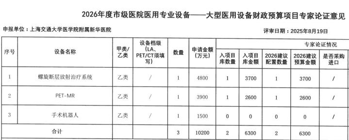

实施周期

**2026年1月 - 2026年12月**

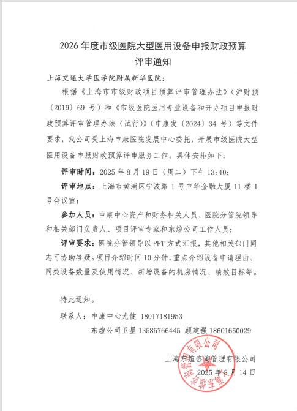

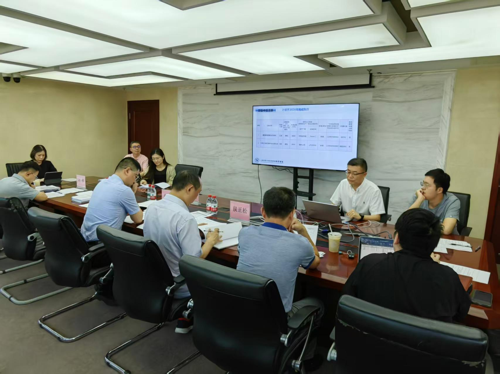

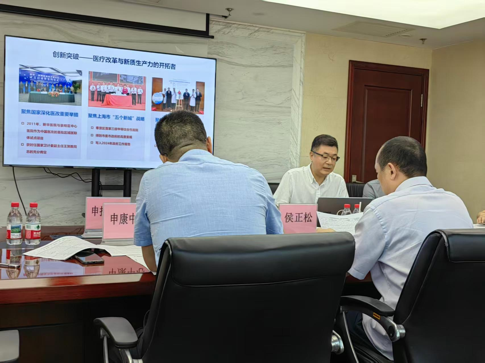

**一体两翼布局：** 新华医院学科发展关键落子

**CHAPTER 02**

## **立项依据**

TOMO与PET-MR配置理由、必要性论证、原有设备使用情况

**JUSTIFICATION - TOMO**

## **TOMO配置理由**

**01**

**精准对接区域疾病谱，填补区域医疗技术空白**

**精准放疗需求**

TOMO可实现 **360度连续螺旋照射** ，对复杂形态肿瘤进行精准打击，保护正常组织

**02**

**强化儿童肿瘤领先地位**

**学科地位**

**全国儿童肿瘤放疗组长单位** ，擅长成人及儿童各种实体肿瘤诊治

**区域战略地位**

奉贤区作为上海"五个新城"之一，缺乏高端放疗设备，患者需跨区就医，增加负担

**技术空白填补**

TOMO配置将填补 **上海南部地区高端放疗技术空白** ，辐射长三角

**专业优势**

上海市最早成立的综合医院肿瘤科之一，首家使用三维CT模拟定位和后装治疗

**示范中心**

打造 **国内领先以儿童肿瘤为特色的TOMO放疗示范中心**

**配置必要性总结**

### **7000+**

年均服务人次

### **360°**

连续螺旋照射

### **长三角**

辐射区域

### **儿童肿瘤**

特色优势

**JUSTIFICATION - TOMO**

## **TOMO  配置理由：强化儿童肿瘤全国领先地位**

**学科地位**

新华医院放疗科是**全国儿童肿瘤放疗组长单位**，在儿童恶性实体瘤的放射治疗领域具有全国领先地位。

### **全国儿童肿瘤放疗组长单位**

儿童神经系统疾病肿瘤患者治疗需求大

集全国疑难病例，需要高端放疗设备支撑

TOMO对儿童肿瘤具有独特治疗优势

**两院区协同布局**

杨浦院区与奉贤院区将形成**"一体两翼、智联互通"** 的整体格局

**功能定位分工**

**杨浦院区**

发挥中心城区疑难重症诊疗中心功能，承接长三角及全国转诊的复杂肿瘤病例

**奉贤院区**

服务奉贤及周边区域，设立**儿童肿瘤放疗亚专业分中心**，扩容服务全国患儿能力

**核心目标**

**计划配置一台高性能TOMO，实现从二代到五代的跨越，显著提升放疗精准度和学科服务能力，有效缓解杨浦院区服务量饱和的压力。**

**巩固我院在儿童肿瘤放疗领域的全国领先地位**

**JUSTIFICATION - PET/MR**

## **PET-MR配置理由**

### **01**

**精准对接区域疾病谱特征**

**奉贤区疾病谱特征**

神经系统疾病、肿瘤、心血管疾病高发，对 **高端分子影像诊断** 需求迫切

**神经系统疾病诊疗优势**

PET-MR在 **脑肿瘤、癫痫、帕金森病、阿尔茨海默病** 等诊断中具有独特优势

**早期诊断与精准分期**

实现疾病的 **早期发现、精准分期、疗效评估** ，提升诊疗水平

### **02**

**技术优势与临床适应性**

**技术先进性**

一次成像同时获得 **PET功能与MR解剖结构** 信息，利用多元化分子探针对疾病诊断具有高度准确性

**飞行时间成像技术(TOF)**

提高了检测 **灵敏度、准确性** 及检测时长，并消除了传统PET常见伪影

**MR无辐射优势**

相比PET/CT， **无电离辐射** ，更适合儿童、孕妇及需多次检查患者

**医院发展需要**

**全市唯一**

同时拥有围产和完整儿科亚专业的综合性医院

**示范基地**

首批国家级儿童早期发展示范基地

**服务区域发展-奉贤首台**

满足奉贤院区及周边区域对高端分子影像的需求

完善医院诊疗体系，提升综合服务能力

年均可服务1000+人次，预约时间缩短至2天内

**JUSTIFICATION - PET/MR**

## **PET-MR配置理由：打造覆盖全生命周期的核医学高水平发展新格局**

**学科布局**

- 构建覆盖全人群、多病种的核医学双院区协同发展格局
- 临床诊疗 + 前沿影像技术
- 强化儿童及神经系统疾病分子影像优势
- 实现两院区功能分工明确、资源协同互补
- 构建“规模化服务 + 精准影像 + 科研转化”一体化体系

**功能定位**

**杨浦院区（核医学诊疗中心）- PET/CT**

- 依托PET/CT承担**大规模常规检查与疑难病例诊疗**
- 保障大批量高效运行与临床服务能力
- 重点方向：肿瘤分期、疗效评估及复发监测；多病种临床诊疗与教学支撑

**奉贤院区（前沿技术中心）- PET/MR**

- 面向儿童、神经系统及复杂疾病精准评估
- 重点方向：神经系统疾病早期诊断与功能成像；肿瘤精准评估及儿童群体；多模态影像融合与研究
- 规划部署：回旋加速器、PET/MR、PET/CT(已取得配置许可证）、全环SPECT等全体系核医学高端设备

**EXISTING EQUIPMENT STATUS**

**原有设备使用情况**

**原有TOMO设备使用情况**

**未配备PET/MR，仅有1台PET/CT**

**设备基本信息**

**设备类型：** TOMO

**配置时间：** 2015年

**设备基本信息**

**设备类型：** PET/CT

**位置：** 杨浦院区

**使用年限：** 10年

**位置：** 杨浦院区

**使用年限：** 15年

**日均检查：** 25-30人次

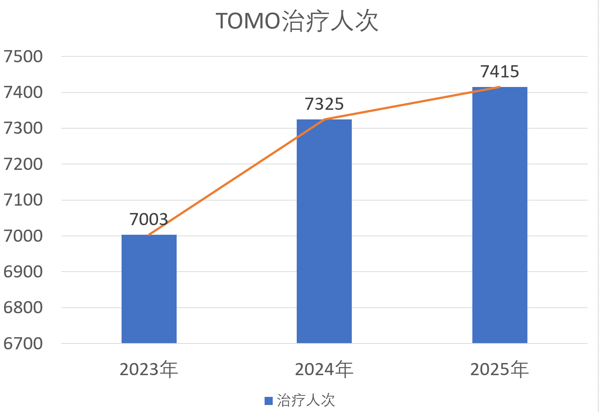

<table><thead><tr><th></th><th>Series1</th></tr></thead><tbody><tr><td>2023年</td><td>3941</td></tr><tr><td>2024年</td><td>3987</td></tr><tr><td>2025年</td><td>4234</td></tr></tbody></table>

**工作量统计（2023-2025年）**

**工作量统计（2023-2025年）**

年均治疗人次

年均FDG PET/CT

**7000+人次**

**4000+人次**

**存在问题**

**存在问题**

**设备老化，故障率逐年上升**

CT辐射剂量较高，不适合特殊人群

<table><thead><tr><th></th><th>Series1</th></tr></thead><tbody><tr><td>2023年</td><td>26</td></tr><tr><td>2024年</td><td>21</td></tr><tr><td>2025年</td><td>37</td></tr></tbody></table>

**技术落后，无法满足复杂病例需求**

软组织分辨率有限，影响诊断准确性

**仅1台设备，服务能力受限**

缺乏MR功能，无法提供解剖细节

**95%+**

**设备利用率**

**PET/CT儿童患者占比：20%**

日均满负荷运转

**儿童放疗患者占比：43%**

**CHAPTER 03**

## **实施内容**

人员配置、场地条件、配置许可证、实施进度计划

**IMPLEMENTATION - TOMO**

## **放疗科人员配置与学科实力**

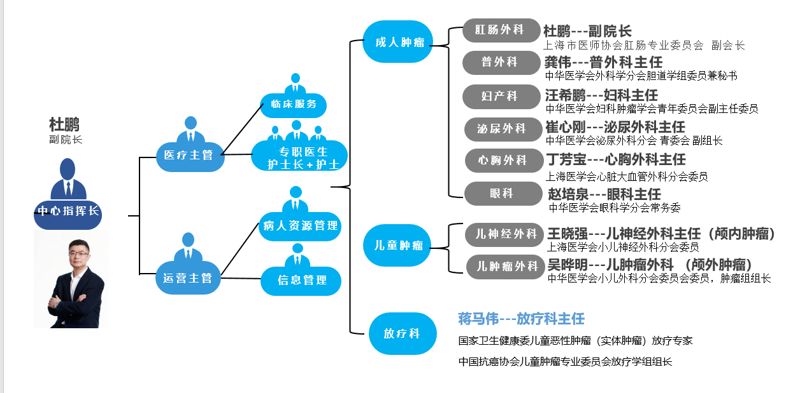

放疗科

**团队结构合理 专业精湛**

**1985年成立**

高级职称

中级职称

### **39年**

### **上海首家**

### **4人**

### **17人**

发展历程

三维CT模拟定位

主任医师/副主任医师

主治医师/主管技师

**学科带头人**

博士学历

硕士学历

### **11人**

### **10人**

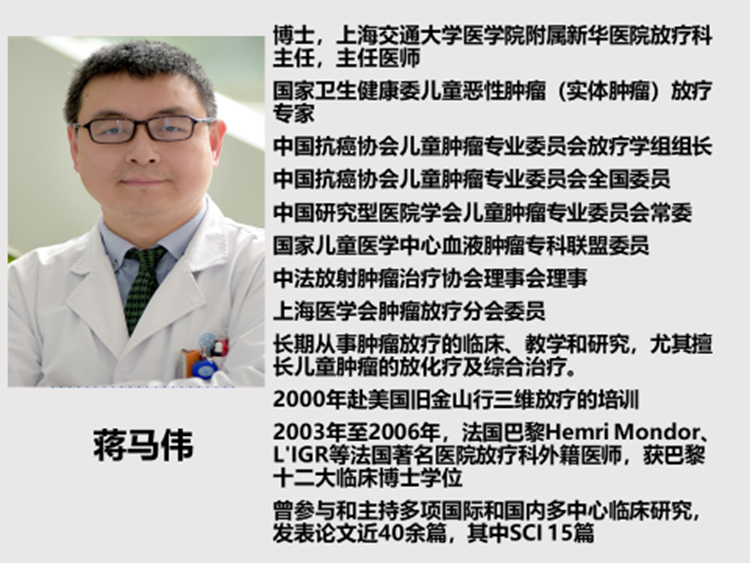

占比高

学历结构优良

**蒋马伟**

放疗科主任

全国儿童肿瘤放疗组长单位负责人

**科研成果斐然 学术精湛**

上海市肿瘤放疗专业委员会副主委

擅长成人及儿童实体肿瘤综合治疗

### **百篇**

### **4项**

近十年SCI论文

国家发明专利

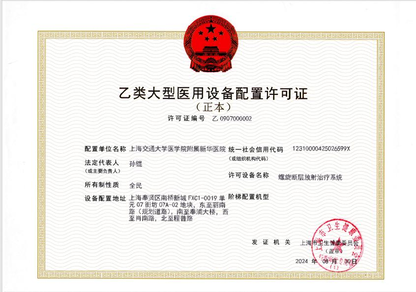

### **组长单位**

全国儿童肿瘤放疗

**新华肿瘤综合诊治中心**

全流程、全生命周期一站式肿瘤综合诊治中心 | **上海市最早成立的综合医院肿瘤科之一**

**IMPLEMENTATION - PET/MR**

## **核医学科人员配置与学科实力**

核医学科

**1960年成立**

### **65年**

发展历程

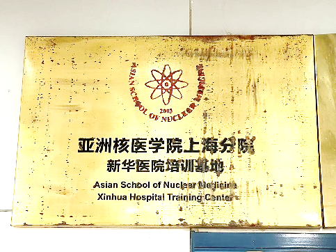

**核医学科人员情况**

**高级职称**

**中级职称**

### **上海领先**

### **7人**

### **11人**

核医学诊疗中心

博导3人，硕导3人

**专业资质齐全**

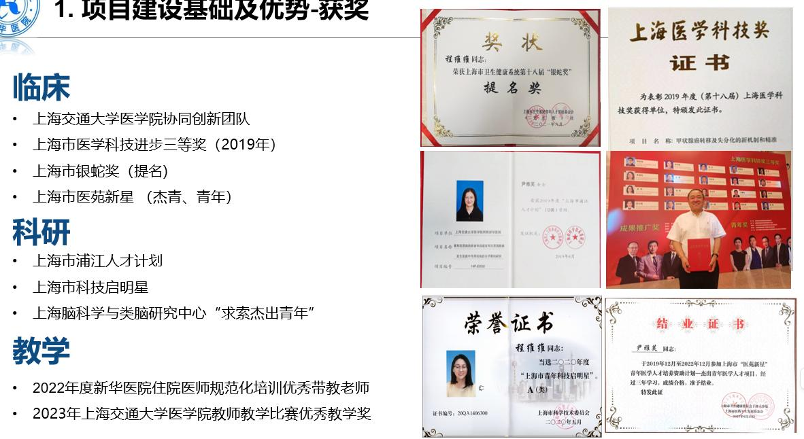

放药团队

**技师+护理团队**

**学科带头人**

### **13人**

### **4人**

**经验丰富**

**博士2人**

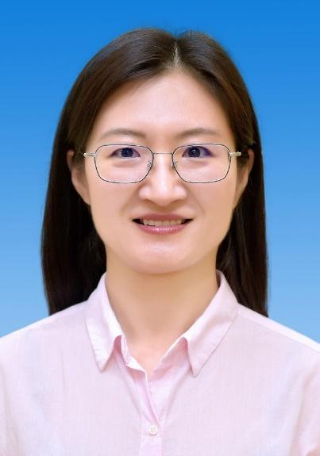

**尹雅芙**

核医学科主任

**设备配置与技术优势**

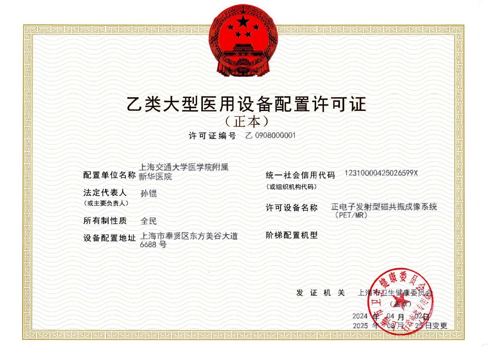

上海市核医学专业委员会副主委

PET/CT：西门子Biograph mCT

擅长PET/CT、PET/MR影像诊断

SPECT/CT：GE Discovery NM/CT 870

核素治疗与分子影像研究

核素治疗病房：标准化核素治疗单元

放射性药物制备中心：回旋加速器

**PET/MR配置许可证**

**已获批**

大型医用设备配置许可证

**乙类**

设备管理类别

**合规**

符合国家配置规划

**IMPLEMENTATION TIMELINE**

**场地条件、配置证与实施进度**

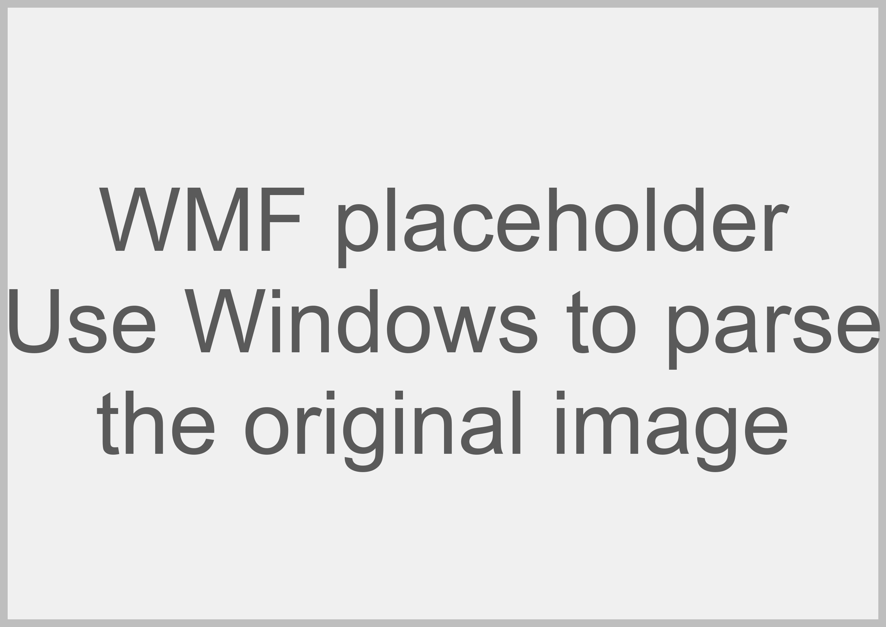

**大型设备机房场地完备**

**TOMO机房**

**位置：** 奉贤院区5号楼地下一层

**面积：** 85平方米

**条件：** 承重、通风、防辐射屏蔽达标、恒温恒湿、电力供应完备

**PET-MR机房**

**符合大型医用设备的结构承重及辐射与电磁环境要求**

**位置：** 奉贤院区5号楼一层

**面积：** 78平方米

**条件：** 承重、通风、辐射屏蔽、磁屏蔽、恒温恒湿、电力供应完备

**2026年项目实施进度计划**

**1**

**第一阶段（4月前）**

完成项目论证

**2**

**第二阶段（7月前）**

完成项目招标，签订合同

**3**

**第三阶段（11月前）**

完成设备验收、临床试验

**4**

**第四阶段（12月前）**

项目总结验收

**配置许可证情况**

PET-MR

TOMO

**已获批**

**已获批**

乙类设备配置证

乙类设备配置证

**配套设施齐全**

**项目实施周期**

**12个月**

2026年全年

**CHAPTER 04**

## **申报预算与测算依据**

预算构成、效益测算、资金来源说明

**BUDGET & CALCULATION**

### **预算构成与资金来源**

**项目总预算**

申报总金额

## **6300万元**

申请市级财政预算

**6300万元**

**资金来源说明**

**市级财政全额拨款**

资金将全部用于采购本项目内的专业设备，确保专款专用

**资金支付计划**

根据计划，在2026年完成全部专业设施设备配置需求采购并投入使用，资金将按此计划进度进行支付

**预算构成明细**

**螺旋断层放射治疗系统**

TOMO

预算金额

**正电子发射型磁共振成像系统**

PET-MR

预算金额

### **3700万元**

### **2600万元**

**预算说明**

预算金额根据市场调研、设备配置要求及同类项目采购价格综合测算确定

**CHAPTER 05**

## **绩效目标**

TOMO与PET-MR项目绩效指标、预期社会效益与经济效益

**BENEFIT CALCULATION**

**效益测算分析**

**TOMO效益测算**

**收费标准**

单次治疗收费约 **6000元** （根据治疗方案）

**工作量预测**

日均治疗

**15-30人次**

年均治疗

**7000+人次**

**年收入预测**

预计年收入 **4000-5000万元**

**投资回收期**

预计 **2-3年** 收回设备投资成本

**PET-MR效益测算**

**收费标准**

单次检查收费 **7150元**

**工作量预测**

日均检查

**5-8人次**

年均检查

**1000-1500人次**

**年收入预测**

预计年收入 **1000万元**

**投资回收期**

预计 **2-3年** 收回设备投资成本

**使用年限**

**10-15年**

设备生命周期

**使用年限**

**10-15年**

设备生命周期

**PERFORMANCE TARGETS**

## **项目绩效目标**

**TOMO项目绩效目标**

**项目总目标**

通过TOMO及时投入使用，有效提高治疗效率，年均诊疗人次 **7000人以上** ，诊疗平均预约时间缩短 **<3天**

患者满意度

**≥92%**

医护人员满意度

**≥92%**

**预期社会效益**

填补上海南部地区高端放疗技术空白

巩固儿童肿瘤放疗全国领先地位

辐射长三角，方便患者就近诊疗

**PET-MR项目绩效目标**

**项目总目标**

通过PET-MR及时投入使用，有效提高诊疗效率，年均诊疗人次达 **1000以上** ，诊疗预约时间缩短 **<2天**

患者满意度

**≥92%**

医护人员满意度

**≥92%**

**预期社会效益**

满足奉贤院区高端分子影像需求

提升神经系统疾病诊断水平

无辐射优势，更适合特殊人群

**预期经济效益**

### **5000-6000万**

年总收入

### **2-3年**

投资回收期

### **10-15年**

设备使用周期

**CHAPTER 06**

## **配置合理性与佐证材料**

设备核心技术参数、论证审批流程、询价供应商对比

**TECHNICAL SPECIFICATIONS**

## **设备核心技术参数**

### **TOMO技术参数**

**放射治疗系统**

**照射方式： 360度连续螺旋照射（全球唯一）**

**机架设计：** 滑环机架，最大旋转速率10RPM

**治疗范围：** 一次摆位最大治疗范围135cm\*40cm

**图像引导系统**

**CT类型：** 兆伏级与千伏级双能螺旋CT系统

**多页光栅：** 气动式驱动，开闭速度<30ms

**等中心精度：** <0.25mm

**技术优势**

双源螺旋CT成像，定位精准、剂量分布优越，对复杂肿瘤治疗优势显著

更好的保护儿童肿瘤患者的正常器官及重要发育器官，减少远期损伤

充分保护危及器官及正常组织，适配现代临床对精准与安全的更高要求

### **PET-MR技术参数**

**PET系统参数**

探测器类型

**SiPM数字PET**

TOF时间分辨率

探测器晶体环数

晶体数量

系统灵敏度

横向视野

**≥450ps**

**≥ 112环**

**≥ 78400块**

**≥ 16cps/kBq**

**≥ 60cm**

**MR系统参数**

系统场强

磁场均匀度（10cm DSV）

最大单轴梯度场强（等效值）

最大单轴梯度切换率

全身扫描范围

**3.0T**

**≥ 0.002ppm**

**≥ 80mT/m**

**≥ 200T/m/s**

**≥ 205cm**

**技术优势**

多元化分子探针高度准确

适合儿童、孕妇等特殊人群

**CONFIGURATION RATIONALITY**

## **论证审批流程与佐证材料**

**论证审批流程**

### **1**

**科室申请**

提交设备购置申请

### **2**

### **3**

**专家论证**

组织医学装备管理委员会论证

**党委会审议**

提交党委会审议，形成决议

### **4**

**申康审批**

报申康审批

### **5**

**财政审批**

报市财政局审批

**相关佐证材料**

**设备配置许可证**

已获得乙类大型医用设备配置许可证

**专家论证意见**

医学装备管理委员会通过，认为配置必要

**党委会决议**

党委会审议通过设备购置事项

**合规性说明**

### **乙类大型医用设备配置许可证**

**螺旋断层放射治疗系统**

TOMO

获批时间

许可证编号

2024年8月

乙0907000002

**正电子发射型磁共振成像系统**

PET-MR

获批时间

许可证编号

2024年4月

乙0908000001

**符合国家配置规划**

设备配置符合国家乙类大型医用设备配置规划要求

**满足区域医疗需求**

符合奉贤区及周边区域医疗服务需求

**医院具备配置条件**

人员、场地、技术等条件完备

**SUPPLIER COMPARISON**

## **供应商询价对比**

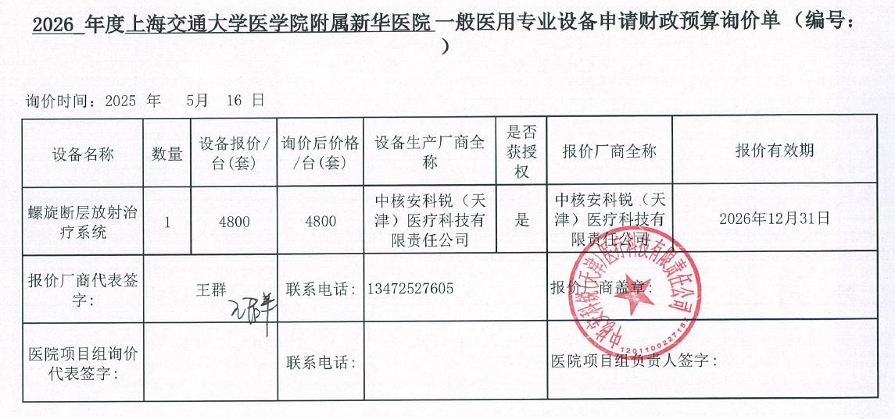

### **TOMO供应商询价情况**

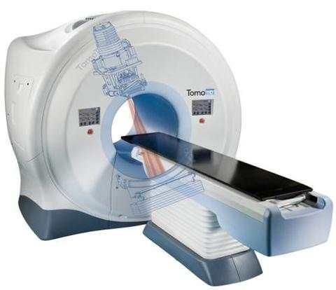

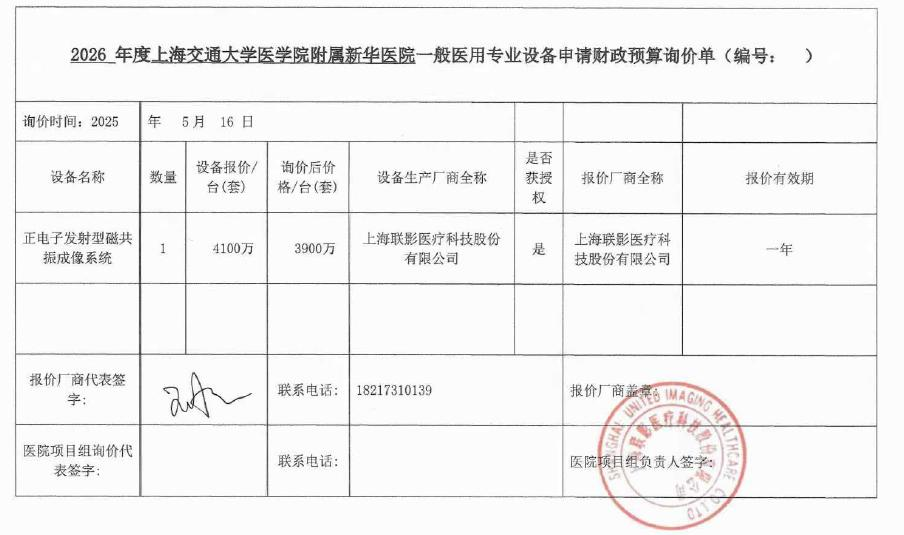

**中核安科锐**

中美合资

**4800万元**

**报价：**

**优势：** 原装进口，技术领先

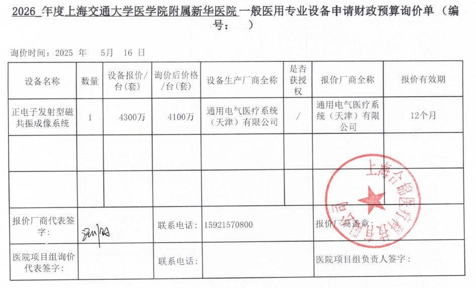

### **PET-MR供应商询价情况**

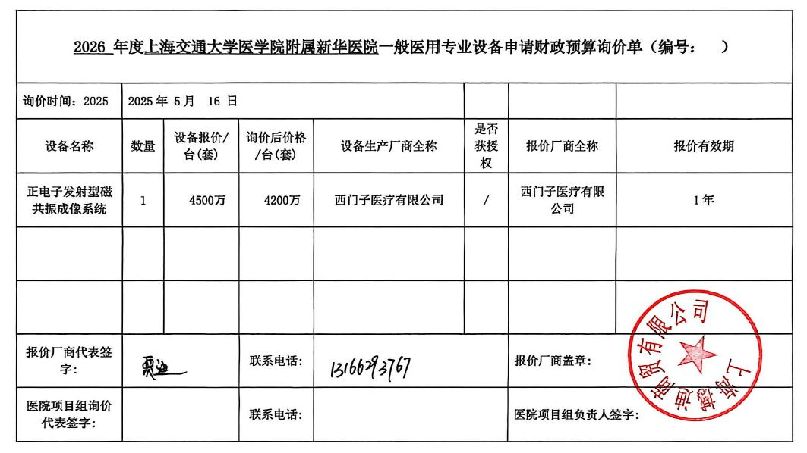

**联影医疗**

**西门子医疗**

**GE医疗**

国产

德国

美国

**3900万元**

**4200万元**

**4100万元**

**报价：**

**报价：**

**报价：**

**优势：** 国产高端，性价比高

**优势：** 国际品牌

**优势：** 国际品牌

## **项目总结与展望**

### **两台高端医疗设备的配置是落实健康上海、健康奉贤行动的重要举措，是新华医院"一体两翼"学科布局的关键落子，也是履行公立医院社会责任、方便患者就近诊疗的民心工程。**

**TOMO**

**作为奉贤区域首台高端放疗设备，将引领本地区及长三角周边区域肿瘤放射治疗进入精准化、个体化新阶段，全面提升复杂及疑难肿瘤的诊疗能级，提升儿童肿瘤放疗的治疗量。**

**PET-MR**

**作为区域首台高端功能影像设备，将引领本地区及长三角周边区域分子影像诊断进入精准化、个体化新阶段，全面提升区域疑难重症诊疗能力。**

**学科影响力提升**

两台设备的落户，将进一步巩固我院儿童肿瘤学科服务全国的领先地位，增强奉贤院区整体医疗服务能级，强化相关科室的学科能力、服务能力与发展布局，提升对奉贤及周边地区的辐射带动作用，为服务全国患者提供坚实保障。

**精准对接区域疾病负担**

**填补区域技术空白**

**辐射长三角及全国**

## **感谢评审专家指导和支持！**

**申报单位**

上海交通大学医学院附属新华医院

**汇报日期**

2026年3月30日

**联系方式**

医院资产管理部

### **新华医院充分具备拟购置大型医用设备配置的硬件与软件条件**

### **非常渴望能够引入高端医疗设备助力医院高质量发展**

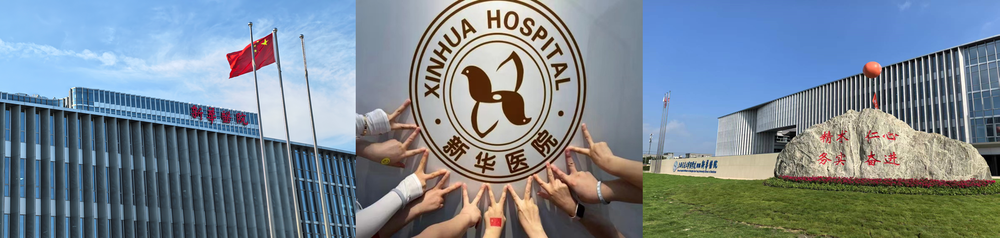